# PROJECT SUMMARY (actio)

## 1) Назначение проекта
`actio` — desktop-приложение для управления задачами и фокусом:
- Канбан-поток задач (колонки + карточки + drag&drop).
- Pomodoro-таймер с учетом выполненных сессий.
- Локальная аналитика по задачам и сессиям.

Проект работает полностью локально, без внешнего backend.

## 2) Технологический стек
- `Electron` (main/renderer, IPC).
- `Vanilla JavaScript` (ES modules, без фронтенд-фреймворка).
- `better-sqlite3` (локальная SQLite БД).
- `marked` (рендер markdown в описаниях задач).
- `electron-builder` (упаковка инсталляторов).

## 3) Точки входа и структура
- `src/main/main.js`: инициализация Electron-приложения, создание окна, регистрация IPC handlers, выбор пути БД.
- `src/main/preload.cjs`: безопасный bridge `window.api` для renderer.
- `src/main/db.js`: схема БД + бизнес-логика (CRUD, фильтры, аналитика, архив, backlog).
- `src/main/todotxt.js`: парсер быстрого ввода в формате todo.txt.
- `src/renderer/index.html`: структура интерфейса (вкладки и панели).
- `src/renderer/app.js`: состояние UI, обработчики событий, вызовы `window.api`, i18n, логика таймера.
- `src/renderer/styles.css`: стили интерфейса.
- `.github/workflows/build-installers.yml`: CI-сборка инсталляторов.

## 4) Функциональные области
### Канбан
- Системные колонки: `Inbox`, `Organise`, `Wait`, `Today`, `Process`, `Done`.
- Пользовательские колонки: создание, удаление, drag&drop-перестановка.
- Карточки задач: markdown-описание, результат, проект/категория/приоритет, план/факт pomodoro, цвет, произвольные атрибуты `key:value`.
- Контекстные меню карточек по колонкам: просмотр/старт/редактирование/перемещение (`Wait`, `Done`) / клон в `Inbox` / удаление с подтверждением.
- Колонка `Today`: отображение задач с расписанием на день, масштабирование по рабочему времени, корректный индикатор текущего времени.
- В шапке приложения показывается активная задача (или первая строка описания) и прямой countdown-gauge.

### Backlog
- Отдельный табличный список невыполненных задач.
- Фильтрация, сортировка, просмотр/редактирование/удаление.
- Перемещение задач из backlog в рабочие колонки.

### Pomodoro
- Настраиваемые интервалы: работа, короткий/длинный перерывы.
- Управление активной задачей: старт, прерывание, отметка выполнения (с подтверждением действий).
- Восстановление состояния после перезапуска приложения: проверка активного таймера, актуализация состояния по текущему времени, автоматический показ вкладки `Pomodoro` при активной сессии.
- Лог сессий и начисление фактических pomodoro по задачам.

### Analytics
- Heatmap активности.
- Flow-метрики (lead time / throughput / WIP-динамика).
- Plan vs fact.
- Фильтры по проекту/категории/приоритету.

### Calendar
- Отдельная вкладка календаря выполнения pomodoro-сессий.
- Отображение активности по неделям/дням.

### Archive
- Просмотр завершенных задач (исторические записи).
- Фильтрация, сортировка, просмотр карточки, клонирование в `Inbox`, удаление записи.

### Settings
- Параметры pomodoro и рабочего дня (`start/end`).
- Тема интерфейса (`system` / `light` / `dark`) и язык (`ru`, `en`, `it`, `de`, `fr`, `be`, `sr`, `ka`).
- Переключатель панели канбана: показывать `Today` или `Process` как фокусную колонку.
- Профили БД: создать пустую, выбрать путь, сделать активной.
- Системные флаги UI (тиканье таймера, расширенный markdown).

## 5) Модель данных (SQLite)
База инициализируется в `src/main/db.js`.


Ключевые таблицы:
- `columns`
- `projects`
- `categories`
- `tasks`
- `task_attributes`
- `task_moves`
- `pomodoro_sessions`
- `spent_events`
- `settings`
- `archive_tasks`
- `backlog_tasks`

Особенности:
- `PRAGMA foreign_keys = ON`.
- `journal_mode = WAL`.
- При инициализации обеспечивается наличие обязательных колонок.
- Есть миграция legacy-имен колонок (`Plan`/`Project` -> `Organise`).

## 6) Хранение и миграция БД
- Целевой путь БД:
  - `<appData>/actio/actio.sqlite`
- Поддерживается override через env:
  - `KANBAN_DB_PATH`
- При первом запуске реализовано копирование БД из legacy-пути:
  - `<userData>/kanban-pomodoro.sqlite`
  - включая `-wal` и `-shm` файлы.

## 7) IPC-контракт
Renderer не вызывает Node API напрямую; все операции идут через `window.api` из preload.

Группы IPC-каналов:
- `board:*`
- `columns:*`
- `projects:*`
- `categories:*`
- `tasks:*`
- `backlog:*`
- `todotxt:*`
- `pomodoro:*`
- `settings:*`
- `analytics:*`
- `archive:*`
- `shell:*`

Формат ответа унифицирован:
- success: `{ ok: true, data }`
- error: `{ ok: false, error }`

## 8) UI и локализация
- Текущие вкладки в `index.html`:
  - `Kanban`
  - `Backlog`
  - `Pomodoro`
  - `Analytics`
  - `Archive`
  - `Settings`
- Локализация хранится в `src/renderer/app.js` (`I18N` объект, RU/EN).

## 9) Сборка и запуск
Требования:
- Node.js 20+ (рекомендуется из CI-конфига).

Локальный запуск:
```bash
npm install
npm run start
```

Пакетирование:
```bash
npm run pack
npm run dist:mac
npm run dist:win
npm run dist:linux
```

Артефакты:
- `release/`

## 10) CI/CD
Workflow: `.github/workflows/build-installers.yml`
- Триггеры: `workflow_dispatch`, push-теги `v*`.
- Matrix:
  - macOS (`dist:mac`)
  - Windows (`dist:win`)
  - Linux (`dist:linux`)
- Публикует артефакты из `release/**`.

## 11) Текущее состояние качества
- Репозиторий в раннем состоянии (на момент подготовки summary: без коммитов).
- Автоматические тесты (unit/integration/e2e) не обнаружены.
- Линтер/форматтер в `package.json` не настроены.

## 12) Практические ориентиры для нового агента
- Все изменения бизнес-логики начинать с `src/main/db.js` и IPC-обвязки в `main.js`/`preload.cjs`.
- Для UI-изменений проверять согласованность:
  - `index.html` (структура)
  - `app.js` (состояние + события + i18n)
  - `styles.css` (визуал).
- При изменениях схемы БД — добавлять безопасную миграционную логику в `initSchema()/seedDefaults()`.
- При добавлении новых действий из UI — сначала описать IPC endpoint, затем метод в preload API.
