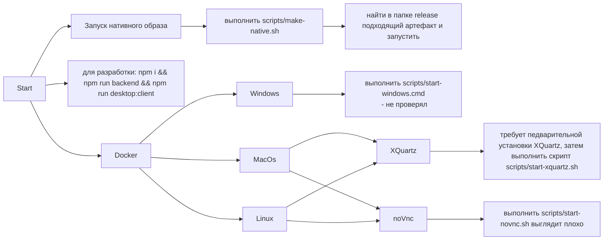
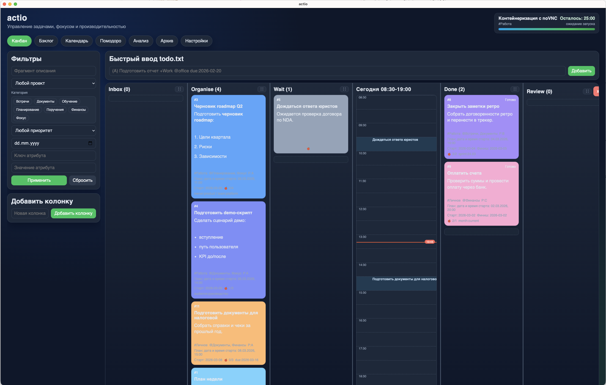
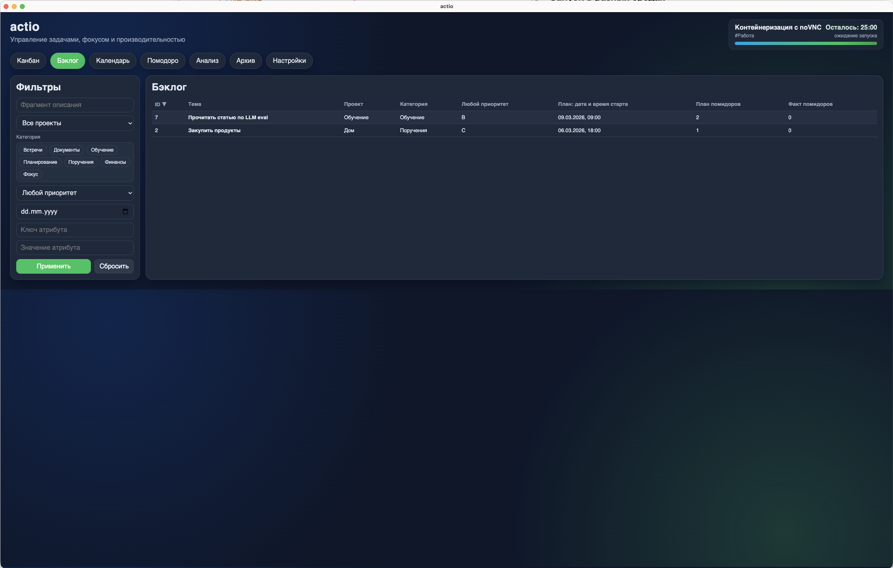
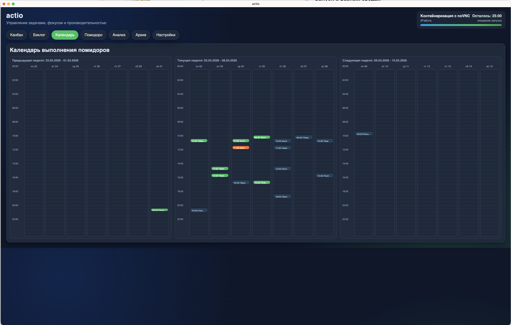
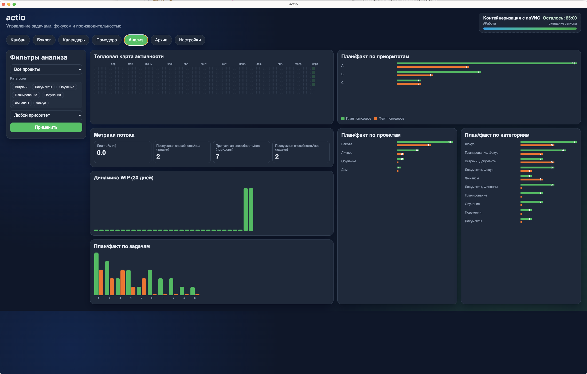
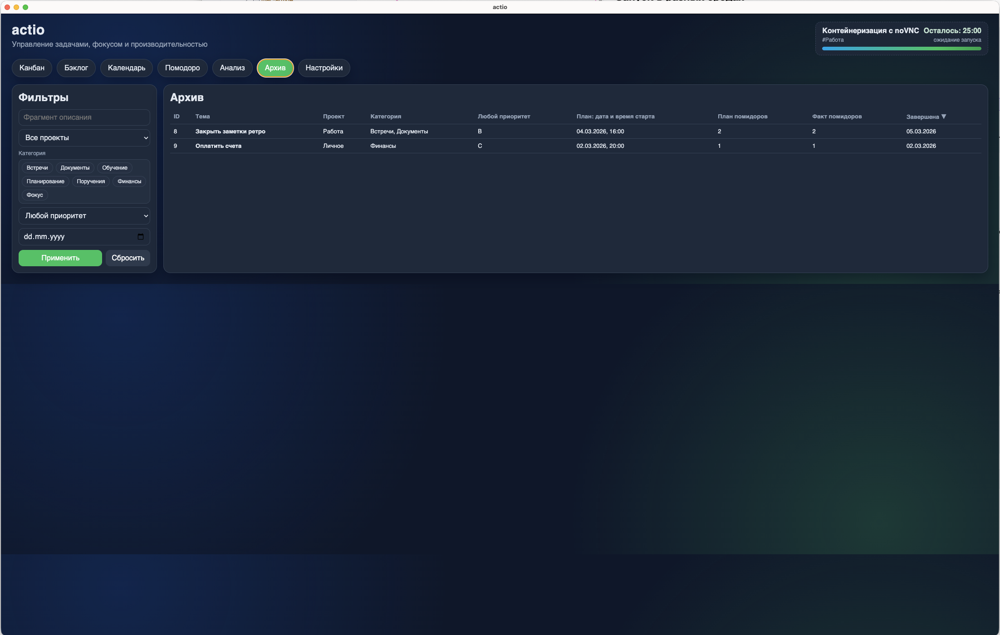
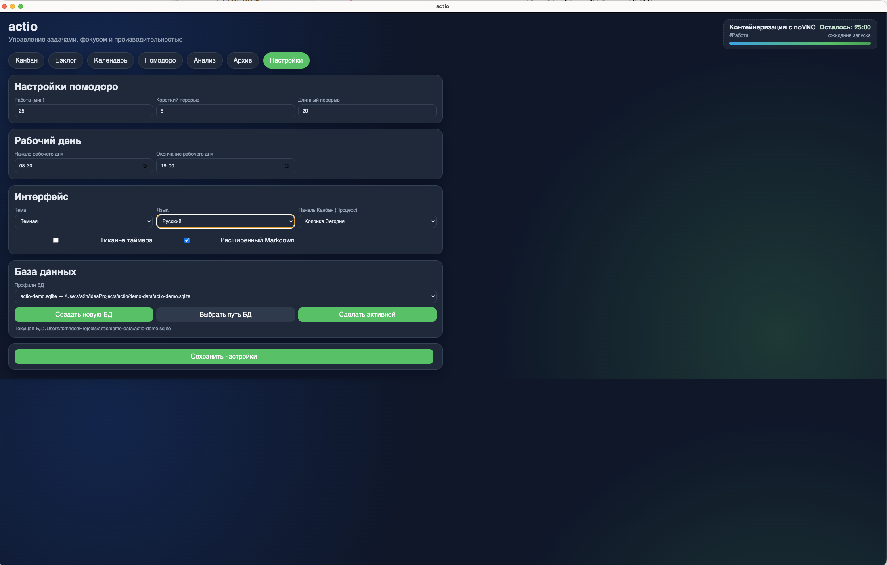

# actio

Desktop-приложение на `Eletron + SQLite` для управления задачами по канбану, отслеживания работы по технике Pomodoro и анализа производительности.
Для чтения README.md и PROJECT_SUMMARY.md желательно установить плагин mermaid

## Стек

- `Electron` (desktop shell + IPC)
- `Vanilla JS (ES modules)` (интерфейс)
- `better-sqlite3` (локальная БД SQLite)

## Единый backend + 2 клиента

Запуск backend (SQLite + бизнес-логика):

```bash
npm run backend
```

Web-клиент:
- открыть `http://localhost:3010`

Desktop-клиент (Electron, работает как клиент backend):

```bash
npm run desktop:client
```

Оба клиента используют одну и ту же БД backend-процесса.

## Запуск в разных средах

Разбил приложение на клиентскую (web и desktop-версии и backend)
Теперь самый простой способ запустить приложение
```shell
docker compose -f docker-compose.web.yml up --build
```
И открыть ссылку [http://localhost:3010](http://localhost:3010)

Также проект можно запускать через:



если в режиме разработки будут проблемы со сборкой - выполнить:
```bash
rm -rf node_modules package-lock.json
npm install
npx electron-rebuild -f -w better-sqlite3
npm run dev
```

При первом запуске в Docker приложение автоматически создаёт профиль БД и подключает
демо-базу `actio-demo.sqlite` из `demo-data`.

После старта для режима noVNC откройте в браузере:

- `http://localhost:6080` (noVNC)
- если не открылось по корню: `http://localhost:6080/vnc.html`

В контейнере поднимается виртуальный X-сервер (`Xvfb`) и `noVNC`, поэтому для данного режима 
установка `XQuartz`/`xhost` на macOS не требуется, но все выглядит просто ужасно.

### Web-версия в Docker

```bash
docker compose -f docker-compose.web.yml up --build --force-recreate
```

Открыть:
- `http://localhost:3010`

### Вариант с XQuartz (без noVNC)
Если нужен вывод окна Electron напрямую в XQuartz

1. Для работы на macOs cначала нужно установить XQuartz:
```bash
brew install xquartz
sudo installer -pkg /opt/homebrew/Caskroom/xquartz/2.8.5/XQuartz-2.8.5.pkg -target /
```

2.
```bash
open -a XQuartz
DISPLAY=:0 /opt/X11/bin/xhost +localhost
/opt/X11/bin/xhost + 127.0.0.1
docker compose -f docker-compose.posix.yml up --build
```

## Реализовано

- 7 вкладок: `Канбан`, `Бэклог`, `Календарь`, `Помодоро`, `Анализ`, `Архив`, `Настройки`
- Обязательные колонки: `Inbox`, `Organise`, `Wait`, `Process`, `Done`
- Добавление/удаление пользовательских колонок
- Карточки задач с drag&drop между колонками
- Перестановка самих колонок через drag&drop (по drag-handle в заголовке колонки)
- Цвет карточек, markdown-описание, дополнительные атрибуты `key:value`
- CRUD задач + выбор активной задачи для исполнения
- Быстрый ввод задач в формате `todo.txt` в `Inbox` с извлечением:
  - приоритета
  - дат создания/завершения
  - контекстов `@`
  - проектов `+`
  - ключей/значений `key:value` 
  

- Хранение колонок/задач/проектов/категорий/приоритетов/сессий в SQLite
- Бэклог с отложенными задачами


- Календарь с прошедшими и планируемыми событиями


- Помодоро-таймер:
  - по умолчанию `25мин/5мин`, длинный перерыв `30мин` после 4 помидоров
  - диалог после завершения помидора (перерыв или следующий помидор)
  - авто-запуск следующего помидора через 10 секунд без ответа
  - отметить задачу завершенной / прервать выполнение
- Аналитика:
  - heatmap выполненных помидоров по дням
  - Lead Time
  - throughput (задачи/помидоры)
  - WIP по дням (30 дней)
  - отклонение план/факт по помидорам
  - фильтры по проекту/категории/приоритету
  

- Архив с выполненными задачами:


- Настройки:
  - длительности помидора и перерывов
  - тема `light/dark`
  - язык `ru/en` и еще несколько языков, правда на них переведены не все надписи, 
их поддержку еще нужно дорабатывать.


## Структура

- `src/main/main.js` — Electron main + IPC handlers
- `src/main/preload.cjs` — безопасный bridge API в renderer
- `src/main/db.js` — схема SQLite и бизнес-логика
- `src/main/todotxt.js` — парсер todo.txt
- `src/renderer/index.html` — UI
- `src/renderer/styles.css` — стили
- `src/renderer/app.js` — клиентская логика
- `.github/workflows/build-installers.yml` — CI сборка установщиков для macOS/Windows/Linux

## Сборка установщиков

```bash
# Подготовка зависимостей
npm install

# Упаковка без инсталлятора (проверка)
npm run pack

# Установщики по платформам
npm run dist:mac
npm run dist:win
npm run dist:linux

# По архитектурам
npm run dist:mac:x64
npm run dist:mac:arm64
npm run dist:win:x64
npm run dist:win:arm64
npm run dist:linux:x64
npm run dist:linux:arm64

# Собрать обе архитектуры для конкретной платформы
npm run dist:mac:all
npm run dist:win:all
npm run dist:linux:all

# Альтернатива для macOS (если DMG недоступен в окружении)
npm run dist:mac:zip
```

Артефакты сборки складываются в папку `release/`.

## Авто-релиз по тегу

Настроен workflow `Build And Release`:

1. Создайте и отправьте тег версии:

```bash
git tag v0.1.0
git push origin v0.1.0
```

2. GitHub Actions автоматически:
- соберет native-артефакты для macOS/Windows/Linux (x64 + arm64),
- создаст GitHub Release по тегу,
- прикрепит к релизу установщики (`.dmg`, `.exe`, `.AppImage`, `.deb`).

## Хранение данных

- SQLite-база хранится в постоянной директории:
  - `macOS/Linux/Windows`: `<appData>/actio/actio.sqlite`
- При первом запуске автоматически выполняется миграция из legacy-пути (`userData`) в новый путь.
